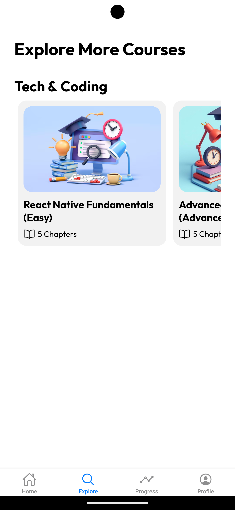
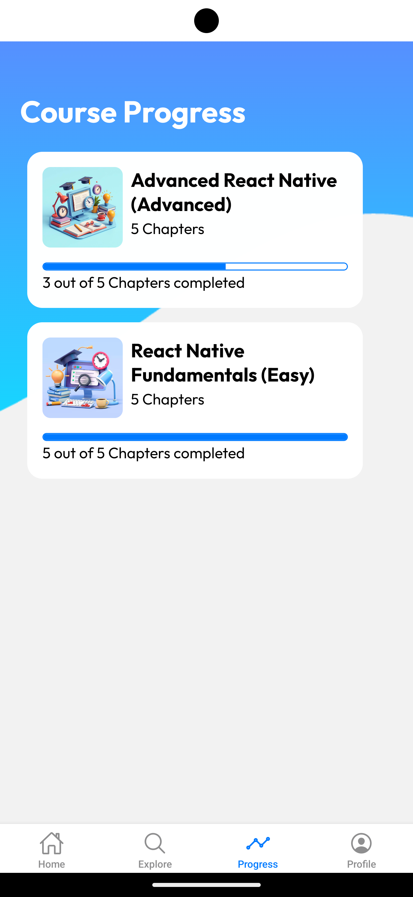
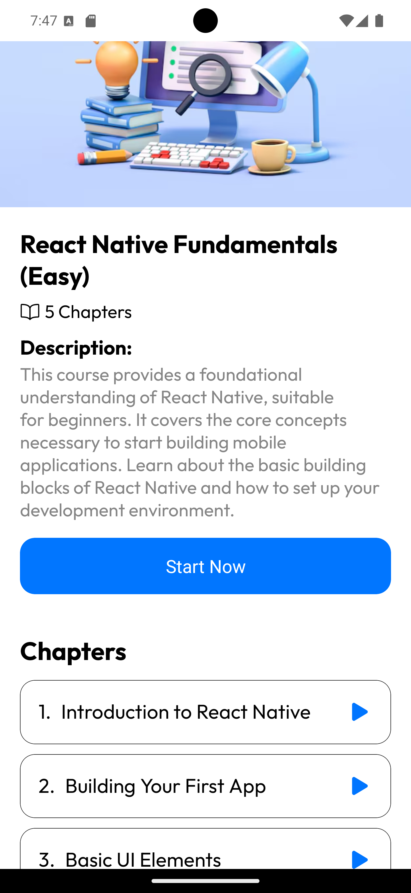
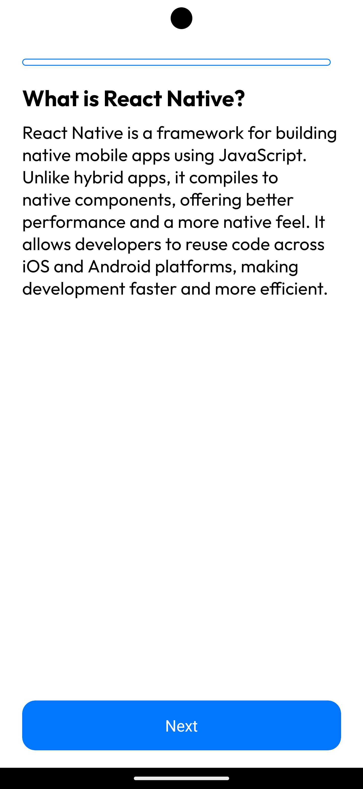
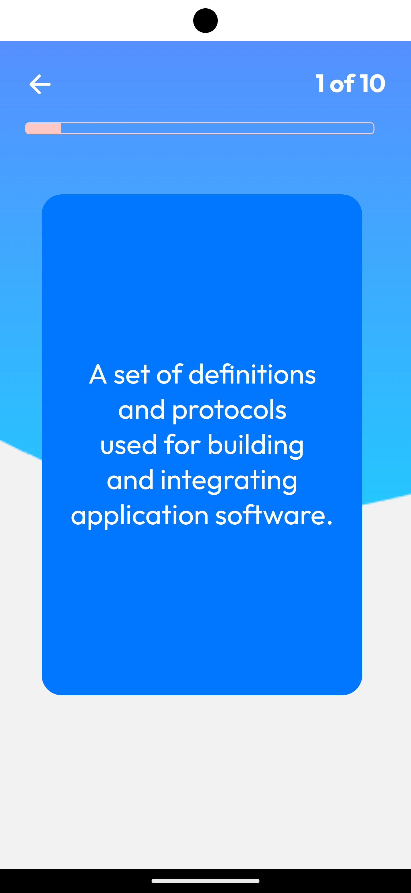
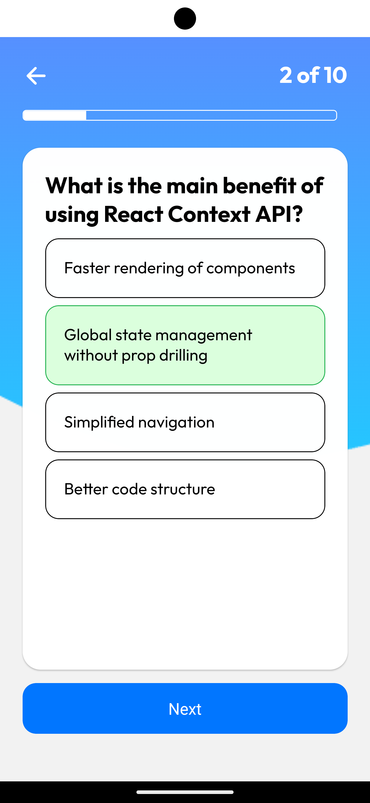
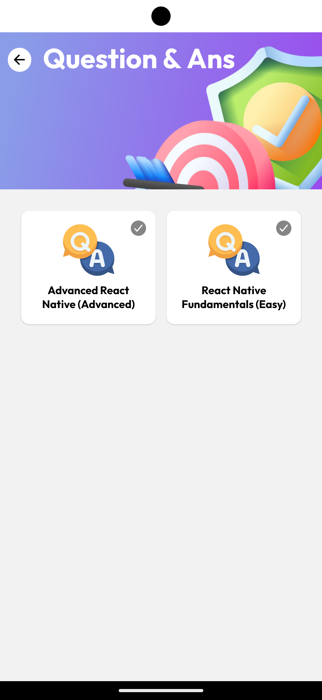
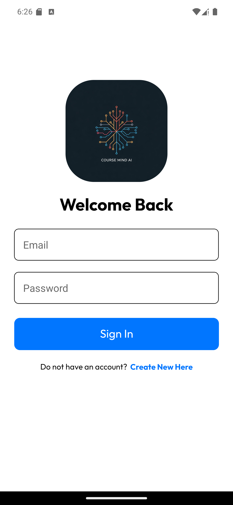
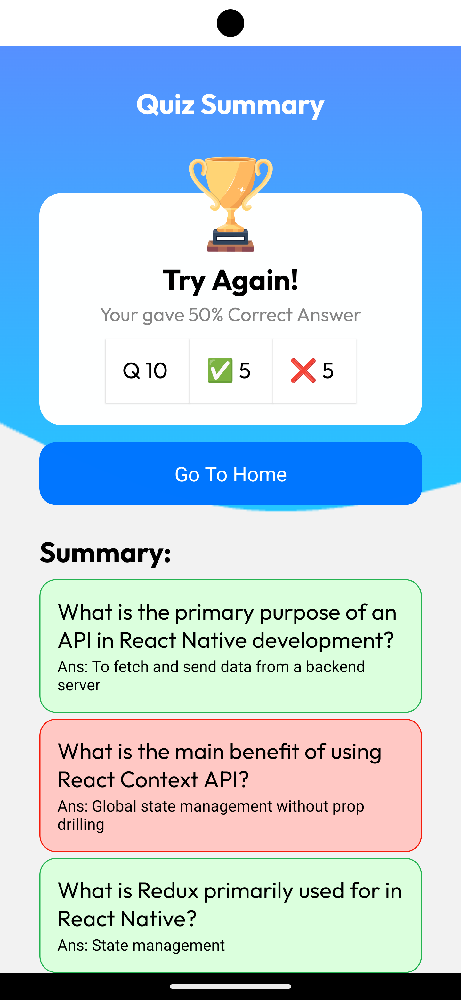

# Course Mind AI 🧠📚 - Your AI-Powered Learning Companion!

[](https://opensource.org/licenses/MIT) <!-- Add a license badge if you have one -->

**Course Mind AI** is a revolutionary React Native application built with Expo, designed to transform the way you create and consume educational content.  Leveraging the power of Google's Gemini AI, Firebase, and a sleek UI, this app empowers users to effortlessly generate and explore personalized learning experiences. Create courses, practice with quizzes and flashcards, and track your progress, all in one place!

## 💖 Support & Donations

If you find this project helpful and would like to support its development, you can make a donation:

- **PayPal**: [mnasserone@gmail.com](mailto:mnasserone@gmail.com)

Your support is greatly appreciated and helps us continue to improve and maintain the project.


## ✨ Features

*   **AI-Powered Course Creation:** 💡 Generate entire courses, including chapters, content, quizzes, flashcards, and Q\&A, simply by providing a topic!  No more tedious manual content creation.
*   **Interactive Learning:** Engage with dynamically generated content, including detailed explanations, code examples, and real-world applications.
*   **Personalized Practice:** Reinforce your learning with quizzes, flashcards, and question-and-answer sections tailored to each course. 📝
*   **Progress Tracking:** Monitor your learning journey with detailed progress indicators for each course and chapter. 📊
*   **User Authentication:** Securely sign up and sign in with email and password using Firebase Authentication. 🔐
*   **Course Exploration:** Discover and enroll in pre-existing courses categorized for easy browsing. 🔍
*   **Responsive Design:**  Enjoy a seamless experience on both iOS and Android devices. 📱
*   **Firebase Integration:**  Data is securely stored and managed using Firebase Firestore. ☁️
*   **Expo Router:**  Smooth and intuitive navigation throughout the app. 🧭
*   **Beautiful UI:**  A clean and engaging user interface built with custom components. 🎨


## 📸 Screenshots

<p align="center">
  
  
  
  
  
    
  
  
      
    
        

</p>

<!-- Replace the image URLs above with actual URLs to your screenshots.  -->
<!-- I recommend uploading the screenshots to a place like GitHub (within your repository) or Imgur. -->
<!-- For GitHub, upload to a folder like `assets/screenshots/` and then use a relative path. -->


## 🚀 Getting Started

### Prerequisites

*   [Node.js](https://nodejs.org/) (LTS version recommended)
*   [npm](https://www.npmjs.com/) or [Yarn](https://yarnpkg.com/)
*   [Expo CLI](https://docs.expo.dev/workflow/expo-cli/): `npm install -g expo-cli`
*   A Firebase project (see "Firebase Setup" below)
*   A Google Cloud project with the Gemini API enabled (see "Gemini API Setup" below)

### Installation

1.  **Clone the repository:**

    ```bash
    git clone https://github.com/nasserml/course-mind-ai-react-native.git
    cd course-mind-ai-react-native
    ```

2.  **Install dependencies:**

    ```bash
    npm install
    ```
    or
    ```bash
    yarn install
    ```

3.  **Create a `.env` file:**

    *   Rename `.env.example` to `.env`.
    *   Fill in your Gemini API Key:

        ```
        EXPO_PUBLIC_GEMINI_API_KEY=<YOUR_GEMINI_API_KEY>
        ```

### Firebase Setup

1.  **Create a Firebase Project:** Go to the [Firebase console](https://console.firebase.google.com/) and create a new project.
2.  **Add Web App:**  In your Firebase project, add a web app.  You'll get a configuration object.
3.  **Enable Authentication:** In the Firebase console, go to "Authentication" and enable the "Email/Password" sign-in method.
4.  **Enable Firestore:** In the Firebase console, go to "Firestore Database" and create a database.  Choose "Start in test mode" for initial development (but remember to set up proper security rules later!).
5. **Add Firebase config details:** Copy and paste the firebase config object from your web app (step 2) in to `config/firebaseConfig.jsx`.
6. **Enable the required packeges:** enable the required packages `firebase/auth` and  `firebase/firestore`

### Gemini API Setup

1.  **Get an API Key:** Follow the instructions on the [Google AI for Developers](https://ai.google.dev/tutorials/setup) website to obtain an API key for the Gemini API.
2.  **Add the API Key:**  Add your Gemini API key to the `.env` file (as shown in the "Installation" section).
3. **Add the API KEY to the config file:** Add the API KEY to `config/AiModel.jsx`.
4. **Enable the required packages:**  Make sure that the required packages are enabled.

### Running the App

1.  **Start the Expo development server:**

    ```bash
    npx expo start
    ```

2.  **Choose a platform:**
    *   Press `a` to run on an Android emulator or connected device.
    *   Press `i` to run on an iOS simulator.
    *   Press `w` to run in a web browser (limited functionality).

    You can also scan the QR code with the Expo Go app on your physical device.


## 📁 Project Structure

```
course-mind-ai-react-native/
├── app/                  # Main application code (Expo Router file-based routing)
│   ├── (tabs)/          # Tab navigation screens (home, explore, progress, profile)
│   │   ├── explore.jsx   # Explore screen
│   │   ├── home.jsx      # Home screen
│   │   ├── profile.jsx   # Profile screen
│   │   ├── progress.jsx  # Progress screen
│   │   └── _layout.jsx   # Tab layout configuration
│   ├── addCourse/       # Course creation screens
│   │   └── index.jsx     # Main course creation screen
│   ├── auth/            # Authentication screens
│   │   ├── signIn.jsx    # Sign-in screen
│   │   └── signUp.jsx    # Sign-up screen
│   ├── chapterView/     # Chapter viewing screens
│   │   └── index.jsx     # Main chapter view
│   ├── courseView/      # Course viewing screens
│   │   └── [courseId]/  # Dynamic route for individual courses
│   │       └── index.jsx # Course details
│   ├── flashcards/      # Flashcard practice screens
│   │   └── index.jsx     # Flashcard view
│   ├── questionAnswer/  # Question & Answer practice screens
│   │   └── index.jsx     # Q&A view
│   ├── quiz/            # Quiz practice screens
│   │   ├── index.jsx     # Quiz view
│   │   └── summary.jsx   # Quiz summary
│   ├── practice/        # Practice type selection screens
│   │    └──[type]/
│   │        └──index.jsx
│   ├── subscriptionWall/# Subscription wall screen (currently a placeholder)
│   │   └── index.jsx     
│   ├── index.jsx         # Initial landing screen
│   └── _layout.tsx      # Root layout (context provider)
├── components/         # Reusable UI components
│   ├── CourseView/     # Components specific to course view
│   │   ├── Chapters.jsx  # Chapter list
│   │   └── Intro.jsx     # Course introduction
│   ├── Explore/         # Components related to explore screen
│   │    └──CourseListByCategory.jsx
│   ├── Home/           # Components specific to the home screen
│   │   ├── CourseList.jsx # Course list display
│   │   ├── CourseProgress.jsx # Course progress display
│   │   ├── Header.jsx      # Home screen header
│   │   ├── NoCourse.jsx    # "No courses" message
│   │   └── PracticeSection.jsx # Practice section
│   ├── Shared/         # General-purpose components
│   │   ├── Button.jsx      # Custom button component
│   │   └── CourseProgressCard.jsx # Card for displaying course progress
│   └── PracticeScreen/   # component related to practice section
│       └──CourseListGrid.jsx
├── config/             # Configuration files
│   ├── AiModel.jsx     # Google Gemini AI model configuration
│   └── firebaseConfig.jsx # Firebase configuration
├── constant/           # Constants
│   ├── Colors.jsx      # Color definitions
│   ├── Option.jsx      # Various options (practice types, image assets, etc.)
│   └── Prompt.jsx      # Prompts for the AI model
├── context/            # React context
│   └── UserDetailContext.jsx # User details context
├── assets/             # Images, fonts, etc.
├── .env.example        # Example environment variables file
├── app.json            # Expo app configuration
├── eas.json             # EAS Build configuration (if using EAS)
├── package.json        # Project dependencies and scripts
├── README.md           # This file!
└── tsconfig.json       # TypeScript configuration
```

## 🤝 Contributing

Contributions are welcome!  Please follow these steps:

1.  Fork the repository.
2.  Create a new branch: `git checkout -b feature/your-feature-name`
3.  Make your changes and commit them: `git commit -m "Add your commit message"`
4.  Push to your branch: `git push origin feature/your-feature-name`
5.  Create a pull request.

Please make sure your code follows the project's coding style and includes appropriate tests.

## 📝 License

This project is licensed under the MIT License - see the [LICENSE](LICENSE) file for details (you'll need to create a LICENSE file if you choose the MIT License).  If you choose a different license, update this section accordingly.

## 📞 Contact

Naser - mnasserone@gmail.com - https://github.com/nasserml/

Project Link: https://github.com/nasserml/course-mind-ai-react-native.git

## 🙏 Acknowledgements

*   [Expo](https://expo.dev/)
*   [React Native](https://reactnative.dev/)
*   [Firebase](https://firebase.google.com/)
*   [Google Gemini API](https://ai.google.dev/gemini-api/docs)
*   [Icons by Ionicons](https://ionic.io/ionicons)

